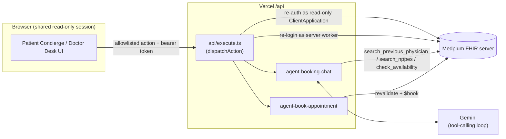

<h1 align="center">🩺 Doctor Appointment Agent</h1>
<p align="center">
  <b>An AI concierge that finds and books real doctor appointments — on a FHIR-native backend.</b><br/>
  A synthetic patient-booking and doctor-desk proof of concept built on <a href="https://www.medplum.com/">Medplum</a>.
</p>

<p align="center">
  <a href="https://doctor-appointment-agent.vercel.app"></a>
  <a href="./LICENSE.txt"></a>
  
  
  
  
  
</p>

<p align="center">
  <a href="#-patient-appointment-concierge">Concierge</a> ·
  <a href="#-how-it-works">Architecture</a> ·
  <a href="#-getting-started">Getting Started</a> ·
  <a href="#-environment-variables">Env Vars</a> ·
  <a href="#-project-structure">Structure</a> ·
  <a href="#about-medplum">Medplum</a>
</p>

> [!IMPORTANT]
> Visitors enter one shared demo code; they do not need Medplum accounts. Everyone uses the same read-only browser
> `ClientApplication` and therefore shares the same synthetic data and browser audit identity. Mutations run through a
> separate server-only worker `ClientApplication`. Doctors are separate FHIR `Practitioner` resources discovered from
> NPPES or synthetic patient history. **This setup is for synthetic demo data only — never real patient data.**

## Overview

This app demonstrates how to build a patient-booking workflow on Medplum where an LLM handles the conversation and
deterministic code handles everything that matters:

- A chat-based **Patient Appointment Concierge** that turns a plain-language request into a grounded, bookable
  appointment — see [below](#-patient-appointment-concierge) for the full agent design.
- Creating [`Slot`](/docs/api/fhir/resources/slot)s to manage provider availability.
- Managing the [`Appointment`](/docs/api/fhir/resources/appointment) lifecycle: creating, rescheduling, and canceling.
- Creating an [`Encounter`](/docs/api/fhir/resources/encounter) after an appointment is completed.
- Using [Medplum React Components](https://storybook.medplum.com/?path=/docs/medplum-introduction--docs) to build a
  scheduling UI.

## 🤖 Patient Appointment Concierge

The patient-facing agent is a real chat: the patient describes what they need in plain language, the agent asks
clarifying questions when it needs to, searches for currently bookable appointments, and proposes options — and books
one only after explicit confirmation. It does not diagnose, recommend treatment, or assess urgency.

**Example request:**

> I have had pain in my throat and constant coughing for the past two days. Find me a nearby doctor. I prefer mornings
> and someone I've seen before.

Behind the chat, Gemini runs a model-directed tool-calling loop: it decides which tools to call and when (search the
patient's previous doctors, search NPPES for other providers, check real Medplum availability), when it has enough
information, and when it needs to ask the patient something instead. **Deterministic code still controls everything
safety-critical** — specialty validation, grounding every proposed pick against a real availability result the tools
actually returned, a distinct-provider cap of 8, and the entire booking path.

If none of the proposed options are a good fit, the patient isn't stuck: the chat input stays open after options are
shown, so they can reply with what they'd like different (*"something in the afternoon instead"*, *"not Dr. Lin,
someone else"*) and the agent picks the search back up — reusing what it already found rather than starting over —
until it proposes a new set of options.

The agent weighs three request-scoped scheduling preferences, in this priority order, when it explains and picks
options: **preferred time of day** (morning/afternoon/evening), **a doctor the patient has previously seen**, and
**proximity** to the patient's recorded address, with earlier availability as the final tie-breaker. These aren't just
prompt guidance — the same priority order is enforced deterministically as a ranking floor whenever the model's own
picks don't already satisfy the distinct-provider cap. Preferences are soft, request-scoped signals, not saved as
long-term patient preferences.

Routing follows a narrow scheduling policy:

| Situation | Behavior |
|---|---|
| An explicit specialty or referral is named | Use it directly |
| A clear complaint maps to a specialty | Use the configured mapping |
| The complaint is ambiguous | Ask **one** clarifying question |
| No specialty preference or clear specialist request | Default to General Practice |

The agent exposes two server-side actions:

- **`agent-booking-chat`** interprets each chat message with Gemini and runs the tool-calling loop described above.
  Deterministic code validates the specialty, searches patient history and NPPES, checks Medplum availability, and
  grounds and caps whatever the model proposes at up to 8 distinct providers before returning it to the patient.
- **`agent-book-appointment`** revalidates the selected provider, schedule, specialty, intake summary, and slot before
  using Medplum's authoritative booking operation. The action is callable only after the patient selects an option and
  passes the explicit confirmation gate. If the slot was taken, it is removed instead of being reported as booked.

After a successful booking, the confirmation page reads the booked `Appointment`, `Slot`, `Schedule`, `Practitioner`,
and `PractitionerRole` from Medplum and shows the doctor, specialty, schedule-local date and time with timezone,
booking status, appointment ID, and NPI.

> [!NOTE]
> **Verification status** — the complete synthetic workflow has been exercised live: multi-turn chat intake, grounded
> provider/slot search, up to 8 distinct provider results, conversational refinement, explicit confirmation, Medplum
> booking, and final booking details. Every change runs the full automated test suite, ESLint, and a production
> TypeScript/Vite build.

## 🧭 How it works



The browser only ever holds a **read-only** token — it cannot create, update, or delete FHIR resources directly, and
Medplum enforces that itself via an `AccessPolicy`, not just app-level checks. Every mutation is re-validated
server-side against live Medplum state before it runs.

### UI and components

- **Patients** page listing all patients in the system.
- **Patient chart** page with three panels: Clinical Chart, Details (Appointments & Encounters), and Actions.
- **Patient agent** for selecting a patient, describing a request in chat, comparing proposed slots from distinct
  providers, refining the search conversationally if none of them fit, confirming one option, and viewing the
  complete booking confirmation.
- **Doctor Desk** for filtering booked appointments by a doctor's NPI.
- **Appointment details** page to view and manage the appointment lifecycle. Legacy `My Schedule` and
  `My Appointments` routes redirect to the patient agent because a demo visitor is not a practitioner.

## 📁 Project structure

```
.
├── src/
│   ├── pages/agent/     # Patient concierge flow (picker → chat → confirmation)
│   ├── pages/desk/      # NPI-scoped doctor desk
│   ├── bots/core/       # Generic appointment lifecycle bots
│   └── bots/agent/      # Concierge bots: booking chat, booking, and lib/ (ranking, grounding, tools, prompts)
├── api/                 # Vercel functions — execute.ts is the sole mutation boundary
├── data/
│   ├── core/            # Required seed data (agent config, service types)
│   └── example/         # Optional demo/test-only data
└── AGENT_OVERVIEW.md     # Full agent spec: routing policy, preferences, safety boundaries
```

See [`AGENT_OVERVIEW.md`](./AGENT_OVERVIEW.md) for the complete agent spec before changing agent behavior, and
[`CLAUDE.md`](./CLAUDE.md) for the full architecture writeup (identities, action wiring, bot conventions).

## 🚀 Getting Started

Create and seed a Medplum project as described by the existing project setup. In that project, create two dedicated
Medplum `ClientApplication` resources; **do not use personal account credentials**:

- A **browser application** with an explicit read-only `AccessPolicy`. It may read/search the FHIR resources
  displayed by the app, but must not have create, update, delete, or operation permissions.
- A **server worker application** with only the FHIR permissions and operations required by booking, intake, chat,
  rescheduling, cancellation, encounter completion, and tagged cleanup. Its token is never sent to the browser.

[Fork](https://github.com/medplum/medplum-scheduling-demo/fork) and clone the repo to your local machine.

### Environment variables

Configure these on Vercel (see `.env.defaults` for the local equivalent):

| Variable | Purpose | Browser-visible? |
|---|---|:---:|
| `MEDPLUM_BASE_URL` | Normally `https://api.medplum.com` | ✅ |
| `MEDPLUM_PROJECT_ID` | The seeded demo project's ID | ✅ |
| `DEMO_ACCESS_CODE` | Shared code given to demo visitors | ❌ |
| `DEMO_MEDPLUM_CLIENT_ID` | Read-only browser `ClientApplication` ID | ✅ |
| `DEMO_MEDPLUM_CLIENT_SECRET` | Browser app secret, used only by `/api/demo-session` | ❌ |
| `DEMO_WORKER_CLIENT_ID` | Server-only worker `ClientApplication` ID | ❌ |
| `DEMO_WORKER_CLIENT_SECRET` | Server-only worker secret | ❌ |
| `GEMINI_API_KEY` | Used by the booking chat and patient-chat actions | ❌ |
| `CRON_SECRET` | Random value (≥16 chars) used by Vercel Cron | ❌ |

> [!WARNING]
> `DEMO_ACCESS_CODE`, both `ClientApplication` secrets, `GEMINI_API_KEY`, and `CRON_SECRET` must never be committed or
> exposed to browser code. There is intentionally no rate limiter, so use a non-trivial shared code and rotate it if
> distributed beyond the intended demo audience.

Administrative seed and direct Bot-deploy tools additionally use `SEED_MEDPLUM_CLIENT_ID` and
`SEED_MEDPLUM_CLIENT_SECRET`. Keep those credentials local to the administrator; the public app does not use them.

### Run it locally

```bash
# 1. Copy env defaults and fill in your values
cp .env.defaults .env

# 2. Install dependencies
npm install

# 3. Build and deploy bots (only if Medplum-hosted Bot deployment is part of your setup)
#    Bots are not on by default for Medplum projects — enable them first.
npm run build:bots

# 4. Run the full app, including /api functions, via Vercel
npx vercel dev
```

The app runs at `http://localhost:3000/`.

> [!TIP]
> `npm run dev` starts the Vite dev server alone (UI only, no `/api` functions) — use `npx vercel dev` (or
> `npm run dev:full`) whenever you need to exercise booking, chat, or any other server action.

## 🧪 Testing & quality

| Command | What it does |
|---|---|
| `npm test` | Run the Vitest suite once |
| `npm run test:watch` | Vitest in watch mode |
| `npm run test:coverage` | Vitest with coverage |
| `npm run lint` / `lint:fix` | ESLint over `src/` and `api/` |
| `npm run build` | Production gate: `tsc` + Vite build |
| `npm run verify` | Tests + API ESM check + build, in one shot |

## 🔒 Shared session behavior

- The code exchange returns only a short-lived token for the read-only browser `ClientApplication`. Both
  `ClientApplication` secrets and the worker token stay on the server.
- Browser writes are denied by Medplum. The app sends only allowlisted actions to `/api/execute`, which re-reads and
  validates trusted FHIR resources before the server-only worker performs a mutation.
- The browser keeps the token in the current tab's `sessionStorage`. Reloading the tab works; closing it ends that
  local session.
- Signing out or closing the tab does not delete booked appointments. Data cleanup is handled by the daily reset.

## 🔄 Daily demo reset

Vercel calls `/api/reset-demo` daily using `CRON_SECRET`. The configured schedule is `30 20 * * *`, which is 02:00
IST. Vercel Hobby may invoke a once-daily cron at any point within that hour, so the practical window is approximately
01:30–02:29 IST.

The reset cancels and deletes only `Appointment`s, `Communication`s, and `Encounter`s carrying the app's
`demo-generated` FHIR tag. Seeded `Patient`s, clinical history, NPPES `Practitioner`s, `Schedule`s, and untagged
resources are preserved. Core data upload is intentionally not exposed in the public demo navigation; seed it as an
administrative setup step instead.

## About Medplum

[Medplum](https://www.medplum.com/) is an open-source, API-first EHR. Medplum makes it easy to build healthcare apps
quickly with less code.

Medplum supports self-hosting and provides a [hosted service](https://app.medplum.com/).

- 📖 Read the [documentation](https://www.medplum.com/docs)
- 🧩 Browse the [React component library](https://storybook.medplum.com/)
- 💬 Join the [Discord](https://discord.gg/medplum)

## License

[Apache 2.0](./LICENSE.txt)
