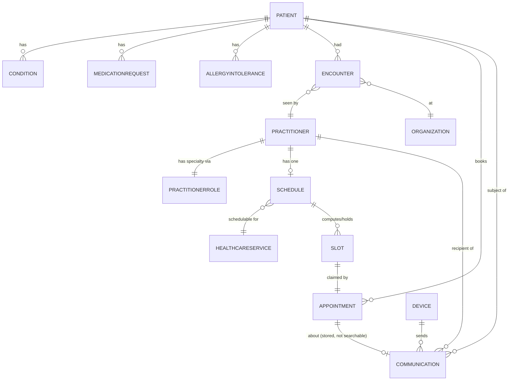

# Doctor Appointment Agent — Data Model

Supersedes the Python-era Data Model doc. Medplum remains the only
datastore — nothing here changes that — but the specific resources used
have expanded (PractitionerRole, Communication, Device, HealthcareService
are new), and one prior decision is explicitly reversed (PractitionerRole
is now adopted). Field names follow FHIR R4 shapes as stored in Medplum;
extension URLs and search parameters marked **confirmed** were checked
directly against the Medplum monorepo source (`packages/definitions`,
`packages/server/src/fhir/operations/utils/scheduling-parameters.ts`), not
assumed from documentation.

Patient/clinical data is seeded once from a Synthea-generated FHIR bundle
dataset (983 patient bundles, `fhir/` at the project root, sourced via
Kaggle — confirmed standard Synthea output) via `tools/seed/`. The app
never generates patient/clinical data itself, only reads it.
`Disease_Description.csv` (41 diseases) at the project root backs the
specialty-resolution fix below.

## Two Doctor Pools

Unchanged organizing idea from the original design, now with a corrected
enrichment mechanism:

| Pool | Source | Specialty |
|---|---|---|
| **Previous physicians** | Riding along in the seeded Synthea bundles | Derived at seed time by a **tiered matcher** (see below) — the original exact-match approach was confirmed to be a no-op against this dataset (0 of 49 real `Encounter.type[].text` values overlap with the 41 disease names) |
| **New doctors** | NPPES, live lookup, mirrored into Medplum on first scheduling request | Real NUCC taxonomy code, returned natively by NPPES |

Both pools resolve to the same shape once queryable: a `Practitioner` +
`PractitionerRole` pair with a real NUCC specialty code, so downstream
code (`agent-find-doctors`) doesn't need to know which pool a doctor came
from.

**Specialty-resolution fix, in brief** (full detail in Design doc §9):
substring-match `Encounter.reasonCode[].coding[].display` and linked
`Condition.code.text` (tier 1 — real clinical signal, present on 11,048 of
the corpus's encounters), fall back to a hand-map covering **all 49**
known `Encounter.type[].text` strings (tier 2 — weaker, encounter *kind*
not diagnosis), fall back to "General Practice" (tier 3). Majority vote
per practitioner across their encounters, same as originally designed —
only the matched-against field changed. **Confirmed via full-corpus audit:
tier 1 alone resolves only 52.27% of practitioners (473/905)** — tier 2 is
doing nearly half the real work, so its hand-map is built and reviewed as
a first-class table, not a rare fallback.

**Naming note**: `nuccCode` (this table, `nppes.ts`'s `DoctorCandidate`) is
the raw taxonomy field name at the data-source boundary; `specialtyCode`
(used in bot request/response payloads — see LLD) is the exact same NUCC
code value, named for its role as an I/O field rather than a table
lookup. Same string, two names depending on context.

## Read-only entities (patient/clinical data, seeded into Medplum from Synthea)

### Patient

| Attribute | Type | Notes |
|---|---|---|
| `id` | string | Medplum resource id |
| `name` | HumanName | display name in patient picker |
| `birthDate` | date | display only |
| `gender` | code | administrative gender |
| `address[0].extension` (`http://hl7.org/fhir/StructureDefinition/geolocation`) | nested extension, `latitude`/`longitude` `valueDecimal` | **confirmed present on every Synthea patient** — this is what makes patient-side distance ranking free (no zip lookup needed); only NPPES-returned doctors need one |

### Condition, MedicationRequest, AllergyIntolerance

Unchanged in shape from the original design — `subject`/`patient`
reference, a `code`/`medicationCodeableConcept`.`text`, `clinicalStatus`/
`status`. Read by `agent-intake` and `agent-patient-chat`; displayed
directly by `@medplum/react`'s `PatientSummary` component on the frontend
(no custom history-assembly code needed — see Backend doc).

### Encounter

| Attribute | Type | Notes |
|---|---|---|
| `id` | string | |
| `subject` | Reference(Patient) | |
| `participant[].individual` | Reference(Practitioner) | source of "previous physician" |
| `serviceProvider` | Reference(Organization) | |
| `period` | Period | |
| `type[].text` | string | tier-2 signal for specialty resolution — the 49 distinct values corpus-wide are encounter *kinds* ("General examination of patient," "Well child visit"), not diagnoses |
| `reasonCode[].coding[].display` | string | **tier-1 signal** for specialty resolution — real condition/reason text, present on 11,048 of the corpus's encounters |

### Practitioner (previous physicians, from the seeded dataset)

| Attribute | Type | Notes |
|---|---|---|
| `id` | string | |
| `identifier` | `[{system: "http://hl7.org/fhir/sid/us-npi", value: "290"}]`-shaped | Synthea's "NPI" values are short/fake (confirmed directly, e.g. `"290"`), never colliding with real 10-digit NPPES NPIs |
| `name` | HumanName | |
| `qualification[0].code.text` | CodeableConcept | display-copy of specialty — dual-written alongside `PractitionerRole.specialty` (below) for any component that reads it, but is **not** the queryable source of truth |

### Organization

Unchanged — `id`, `name`, used for encounter context display only.

## Written entities (doctor/scheduling/AI-artifact data, created by the app itself)

### Practitioner (new, mirrored from NPPES)

Same shape as above, populated the first time an NPPES NPI is scheduled
against. Lookup key: `identifier` search on the NPI system, which is what
makes creation idempotent.

### PractitionerRole *(new in this design — reverses the original decision to skip it)*

| Attribute | Type | Notes |
|---|---|---|
| `id` | string | |
| `practitioner` | Reference(Practitioner) | |
| `specialty` | `CodeableConcept` with NUCC coding | **confirmed real, indexed search parameter** (`PractitionerRole?specialty=...`) — this is what makes "has this patient seen this specialty before" a single query instead of pulling every practitioner and filtering in code, which is what the original Python design had to do |
| `organization` | Reference(Organization) | for NPPES-mirrored doctors |

Why adopted now: `Practitioner.qualification` is licenses/certifications/
degrees, not specialty — using it for specialty was a POC shortcut in the
original design, and `PractitionerRole.specialty` is the semantically
correct, queryable field. Cost is one extra conditional-create per
practitioner; `Practitioner.qualification[0].code` is still dual-written
as a display copy.

### Schedule

| Attribute | Type | Notes |
|---|---|---|
| `id` | string | |
| `actor` | Reference(Practitioner), **exactly one** | confirmed hard requirement — `getSchedulingParametersGroup` throws `'Scheduling only supported on schedules with exactly one actor'` if violated |
| `serviceType` | `CodeableConcept[]`, **0..\* — confirmed directly** (`min:0, max:"*"` in Medplum's R4 StructureDefinition) | includes **both** HealthcareServices (Office Visit + Urgent Visit) so either can be requested via `$find`'s `service-type-reference` param depending on the patient's `urgency`. **Confirmed exact matching mechanic** (`packages/server/src/util/servicetype.ts`): R4 has no native `CodeableReference`, so Medplum represents "this concept points at that HealthcareService" via an extension embedded on the `CodeableConcept` itself — `{extension: [{url: 'https://medplum.com/fhir/service-type-reference', valueReference: {reference: 'HealthcareService/{id}'}}]}` — one such entry per HealthcareService. `isCodeableReferenceLikeTo` checks with `.some(...)` across the array — "is the requested service *present*," not "is it the only one" — so a two-entry array naturally supports both visit types on one Schedule |
| extension: `SchedulingParameters` | complex, **confirmed exact URL**: `https://medplum.com/fhir/StructureDefinition/SchedulingParameters` | see attribute breakdown below |

**`SchedulingParameters` sub-extensions** (confirmed directly from
`scheduling-parameters.ts`): `duration`, `alignmentInterval`,
`alignmentOffset`, `bufferBefore`, `bufferAfter` (all `valueDuration`);
`service` (`valueReference` to HealthcareService); `timezone`,
`alignmentTimezone` (`valueCode`, IANA); `availability` (nested, containing
`availableTime` blocks with `daysOfWeek`/`allDay`/`availableStartTime`/
`availableEndTime`, or `notAvailableTime` blocks with `description`/
`during`).

**Gotcha, confirmed from source, worth documenting precisely**:
`availableTime`'s `daysOfWeek` sub-extension repeats once per day — a
doctor working Mon/Wed/Fri needs three separate `{url: 'daysOfWeek',
valueCode: ...}` entries inside one `availableTime` block, not one entry
holding an array of days.

**Timezone requirement, confirmed**: every `Schedule` must resolve a
timezone from *somewhere* — either its own/its HealthcareService's
`SchedulingParameters.timezone`, or the actor's
`http://hl7.org/fhir/StructureDefinition/timezone` extension — or `$find`
throws `'No timezone specified'`. `ensurePractitionerAndSchedule` sets
this from a small state→IANA-zone table.

**Generation rule** (unchanged intent from original design): working
days/hours/lunch gap are derived deterministically from the doctor's NPI
as a seed, so the same NPI always produces the same weekly template.
Created once per `Practitioner`, looked up by `actor` reference
thereafter. Schedules start fully open — no fake pre-booked history.

### Slot

| Attribute | Type | Notes |
|---|---|---|
| `id` | string | only exists once busy/held/blocked — **confirmed** free time is computed live by `$find`, never persisted as a resource. **Always a standalone, independently searchable resource — never `contained` inside an Appointment.** `agent-expire-holds` depends on this: it searches `Slot?status=busy-tentative` directly, which would find nothing if Slot were embedded in the Appointment. Deleted (not status-flipped) once its owning Appointment is cancelled — see `cancel-appointment.ts` in the LLD. |
| `schedule` | Reference(Schedule) | |
| `start`/`end` | dateTime | 30 or 15-minute granularity, matching whichever `HealthcareService.duration` was requested |
| `status` | code | `busy-tentative` (post-`$hold`) → `busy` (post-`$confirm`) |

### Appointment

| Attribute | Type | Notes |
|---|---|---|
| `id` | string | |
| `status` | code | `proposed` → `pending` (post-`$hold`) → `booked` (post-`$confirm`) |
| `start`/`end` | dateTime | |
| `participant[]` | Patient + Practitioner references | `Appointment:actor` and `Appointment:patient` both confirmed real search parameters |
| `serviceType` | CodeableReference(HealthcareService), with the `https://medplum.com/fhir/service-type-reference` extension | required by `$hold`; whichever of Office Visit/Urgent Visit matches `urgency` |
| `slot` | Reference(Slot)[] | set by `$hold`/`$confirm`; what `agent-expire-holds`, `cancel-appointment.ts`, and `reschedule-appointment.ts` resolve to find/release the held Slot |
| `description` | string | **the "stated issue" shown on the doctor's queue card** — the LLM's short reason string, written by `agent-book-appointment` after `$confirm` |
| `comment` | string | the patient's verbatim complaint text (longer, raw) — not shown on the queue card, only `description` is |
| `reasonCode[0].text` | string | same value as `description` — a structured-field copy for any FHIR-standard tooling that reads `reasonCode` instead |
| `priority` | integer | derived from `urgency` |

### Communication *(new — stores both the pre-visit summary and every chat turn)*

Chosen over an Appointment extension, `DocumentReference`, or
`Composition` — see Design doc rationale. `recipient`, `subject`, `sent`,
and `category` are all **confirmed real search parameters**;
**`Communication:about` is confirmed to NOT exist as a search parameter**
in this Medplum version (checked directly against the search-parameter
definitions) — `about` is still a valid *field* to store on the resource,
just not one anything in this design queries by.

| Attribute | Type | Notes |
|---|---|---|
| `id` | string | |
| `status` | code | `preparation` (drafted at intake, no recipient yet) → `completed` (once the doctor is known, at booking time) |
| `category[0].coding` | small custom CodeSystem | `ai-previsit-summary` or `ai-chat` |
| `priority` | code | the patient's stated `urgency`, as a real code |
| `subject` | Reference(Patient) | |
| `sender` | Reference(Device) | see `Device` below |
| `recipient` | Reference(Practitioner)[] | empty until booking confirms which doctor |
| `about` | Reference(Appointment)[] | stored, not searched |
| `sent` | dateTime | |
| `payload[0].contentString` | string | the summary text, or one chat turn's content |
| `partOf` | Reference(Communication)[] | threads chat turns together |
| `meta.tag` | `[{code: 'ai-generated'}]` | machine-authorship marker, explicit in the data, not just a UI disclaimer. **Present only on `Device`-authored Communications** (the pre-visit summary, and the AI's chat answers) — **absent** on the doctor's own chat-question Communications (`sender: Practitioner`), since those are human-authored |

### Device *(new — marks AI-generated content)*

One singleton, conditional-created at seed time: `Device/ai-appointment-agent`.
Used only as `Communication.sender` — FHIR's correct actor type for
machine-generated content, so "a machine wrote this" is a queryable fact,
not just a banner in the UI.

### HealthcareService *(new — required by `$find`/`$hold`)*

Two singletons, both created at bootstrap: "Office Visit" (30-minute
`duration`) and "Urgent Visit" (15-minute `duration`). Every `Schedule`
lists both in its `serviceType` array (see `Schedule` above); which one a
given booking uses is decided by the patient's stated `urgency` —
`routine` → Office Visit, `urgent` → Urgent Visit — resolved into concrete
ids by `agent-ensure-doctor` (LLD) and picked by the caller before
`agent-book-appointment` runs. This is settled, load-bearing behavior, not
an open item. `HealthcareService` is about *what kind of visit*, not *what
kind of doctor* — specialty lives on `PractitionerRole`, not here.

## "Every patient who's ever booked with NPI X"

Confirmed queryable without depending on any unconfirmed search-parameter/
modifier support:

```
① Practitioner?identifier=http://hl7.org/fhir/sid/us-npi|{npi}
② Appointment?actor=Practitioner/{id}&_include=Appointment:patient&_sort=-date
③ Communication?recipient=Practitioner/{id}&category=...ai-previsit-summary&_include=Communication:subject
```

② and ③ run in parallel, joined in memory on the patient reference. This
deliberately avoids `_revinclude` on `Communication:about` (confirmed not
to exist) and any `:identifier` reference-chaining modifier that hasn't
been verified.

## Entity Relationships



## Not modeled

- No `Composition` or `DocumentReference` for the AI summary — considered
  and rejected as over-engineered for a 2–3 sentence artifact (see Design
  doc rationale); `Communication` covers the actual requirements.
- No real per-doctor `AccessPolicy` enforcement in the core flow — NPI
  entry on `/desk` is an intentional display filter, not authentication
  (Design doc §11). A demonstration `AccessPolicy` remains an optional,
  separate future item, not part of this data model.
- No clinically-authoritative specialty taxonomy beyond NUCC — NUCC itself
  is a real, standard code system (used natively by NPPES), so this is a
  smaller simplification than the original design's free-text specialty
  labels, not a new one.
- No local cache/table of NPPES search results — every `agent-find-doctors`
  call hits NPPES live; only the doctor actually selected for scheduling
  gets mirrored into Medplum.
- No use of the `appointments.csv` no-show dataset — evaluated and
  rejected in the original design (no doctor/specialty column, no ID
  overlap with our pools); this rebuild doesn't reopen that question.
