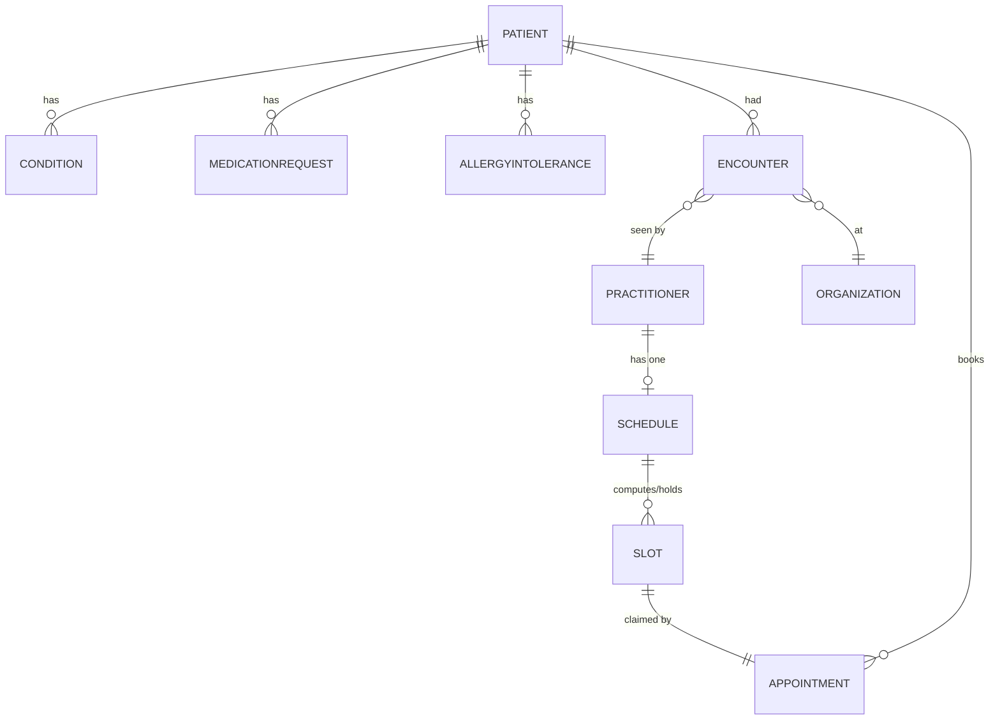

# Doctor Appointment Agent — Data Model

There is no application-owned relational database — Medplum is the only
datastore (Design doc §2, §5). This document is the logical schema: every
entity this app reads or writes, and the attributes it actually uses on
each, presented table-style (the closest equivalent to "DB tables/rows" for a
FHIR-resource-backed app). Field names follow FHIR R4 resource shapes as
stored in Medplum.

Patient/clinical data is imported from a Synthea-generated FHIR bundle
dataset (983 patient bundles, sourced via Kaggle — confirmed to be standard
Synthea output: `Bundle`/`transaction` shape, Synthea-attributed
`Organization.identifier`) into Medplum ahead of time. This app never
generates patient/clinical data itself, only reads it.

`Disease_Description.csv` (project root, 41 diseases) is used at import time
as the backbone of the specialty-enrichment mapping — see "Specialty
enrichment" below. `appointments.csv` (project root) was evaluated and
rejected: it's a no-show/attendance dataset with no doctor or specialty
column and no ID overlap with our Patient/Practitioner pools, and using it
would reintroduce the fake-attendance-history complexity already dropped
from the schedule design (Design doc §5).

## Two Doctor Pools

There are two distinct sources of `Practitioner` data in this app, with
different provenance and different specialty-data quality. Everything below
is organized around this split:

| Pool | Source | Has specialty natively? |
|---|---|---|
| **Previous physicians** (§ below) | Riding along in the Synthea/Kaggle patient bundles, already in Medplum | **No** — confirmed absent dataset-wide (0 of 983 files contain `qualification`, `PractitionerRole`, or `specialty`); derived from their encounters' conditions at import time, see "Specialty Enrichment" below |
| **New doctors** (search path) | NPPES API, live lookup, mirrored into Medplum on first scheduling request | Yes — NPPES taxonomy gives a real specialty |

Downstream code (`patients.find_previous_practitioner_by_specialty`) doesn't
need to know which pool a `Practitioner` came from — both end up with a
`qualification[].code` populated by the time they're queryable, just via
different means (enriched at import vs. copied from NPPES).

## Read-only entities (patient/clinical data, imported into Medplum from the Synthea/Kaggle dataset)

### Patient

| Attribute | Type | Notes |
|---|---|---|
| `id` | string | Medplum resource id |
| `name` | HumanName | display name shown in patient picker |
| `birthDate` | date | used for age-appropriate display only |
| `gender` | code | administrative gender |
| `identifier` | Identifier[] | not used beyond Medplum's own id |

### Condition

| Attribute | Type | Notes |
|---|---|---|
| `id` | string | |
| `subject` | Reference(Patient) | links back to the patient |
| `code` | CodeableConcept | condition name/text shown in history |
| `clinicalStatus` | code | active/resolved — shown for context, not filtered on |

### MedicationRequest

| Attribute | Type | Notes |
|---|---|---|
| `id` | string | |
| `subject` | Reference(Patient) | |
| `medicationCodeableConcept` | CodeableConcept | medication name |
| `status` | code | active/stopped — display only |

### AllergyIntolerance

| Attribute | Type | Notes |
|---|---|---|
| `id` | string | |
| `patient` | Reference(Patient) | |
| `code` | CodeableConcept | allergen |
| `criticality` | code | display only |

### Encounter

| Attribute | Type | Notes |
|---|---|---|
| `id` | string | |
| `subject` | Reference(Patient) | |
| `participant[].individual` | Reference(Practitioner) | source of "previous physician" |
| `serviceProvider` | Reference(Organization) | clinic/org the encounter happened at |
| `period` | Period | encounter date, shown in history |
| `reasonCode` | CodeableConcept[] | display only for the patient's own history view; also the input signal used to derive the linked practitioner's specialty at import time (see below) |

### Practitioner (previous physicians, from past Encounters in the imported dataset)

| Attribute | Type | Notes |
|---|---|---|
| `id` | string | |
| `name` | HumanName | displayed as "previous physician" |
| `qualification[].code` | CodeableConcept | **not present in the source Synthea/Kaggle data** — the raw bundles have no `qualification`, no `PractitionerRole`, and no specialty info anywhere (confirmed across all 983 files). This field is written in by the one-time import/enrichment step below, not by Synthea. Once enriched, it's matched against the LLM-extracted specialty in `patients.find_previous_practitioner_by_specialty` exactly like NPPES-sourced practitioners. |

**Specialty enrichment (one-time, at import): derived from encounter
conditions via `Disease_Description.csv`, not assigned arbitrarily.** The
source data has no direct specialty field, but it does carry a real clinical
signal: each `Encounter` a practitioner participated in has a
`reasonCode`/`type.text` naming the condition in plain English (e.g. "Cardiac
Arrest," "Prediabetes"). `Disease_Description.csv` supplies 41 real disease
names to match that text against — a larger, more legitimate reference set
than guessing at SNOMED codes. The file itself only has `Disease,
Description` columns (no specialty), so a `Specialty` column is added once,
by hand, to build the mapping used at import:

| Disease | Specialty |
|---|---|
| Drug Reaction | Allergy and Immunology |
| Malaria | Infectious Disease |
| Allergy | Allergy and Immunology |
| Hypothyroidism | Endocrinology |
| Psoriasis | Dermatology |
| GERD | Gastroenterology |
| Chronic cholestasis | Gastroenterology |
| hepatitis A | Gastroenterology |
| Osteoarthristis | Orthopedics |
| (vertigo) Paroymsal Positional Vertigo | Otolaryngology (ENT) |
| Hypoglycemia | Endocrinology |
| Acne | Dermatology |
| Diabetes | Endocrinology |
| Impetigo | Dermatology |
| Hypertension | Cardiology |
| Peptic ulcer diseae | Gastroenterology |
| Dimorphic hemorrhoids(piles) | General Surgery |
| Common Cold | General Practice |
| Chicken pox | Infectious Disease |
| Cervical spondylosis | Orthopedics |
| Hyperthyroidism | Endocrinology |
| Urinary tract infection | Urology |
| Varicose veins | Vascular Surgery |
| AIDS | Infectious Disease |
| Paralysis (brain hemorrhage) | Neurology |
| Typhoid | Infectious Disease |
| Hepatitis B | Gastroenterology |
| Fungal infection | Dermatology |
| Hepatitis C | Gastroenterology |
| Migraine | Neurology |
| Bronchial Asthma | Pulmonology |
| Alcoholic hepatitis | Gastroenterology |
| Jaundice | Gastroenterology |
| Hepatitis E | Gastroenterology |
| Dengue | Infectious Disease |
| Hepatitis D | Gastroenterology |
| Heart attack | Cardiology |
| Pneumonia | Pulmonology |
| Arthritis | Rheumatology |
| Gastroenteritis | Gastroenterology |
| Tuberculosis | Pulmonology |

Import logic:

1. Normalize each `Encounter.type[].text` (lowercase, trim) and match it
   against the `Disease` column above (exact/near-exact match — the source
   list itself already has minor typos like "Osteoarthristis" and "diseae,"
   which is fine since we're matching against this exact list, not a
   dictionary). No match → no candidate specialty from that encounter.
2. For each `Practitioner`, collect every `Encounter` they participated in
   across the imported dataset, map each to a specialty candidate via the
   table above, falling back to "General Practice" for any practitioner
   with zero matching encounters.
3. Assign the practitioner the most frequent candidate specialty across
   their encounters, and write it into `Practitioner.qualification[].code`.

This is naturally deterministic — a pure function of each practitioner's
actual encounter data, not a random seed — so re-running the import produces
the same assignments every time. It's still a heuristic (41 diseases won't
cover every `Encounter.type.text` in 983 patient bundles, and the
Disease→Specialty column above is hand-categorized, not a clinical coding
standard), but it's grounded in what the doctor actually treated rather than
being arbitrary, which matters for demo credibility: a doctor who saw a
patient for a heart attack should plausibly end up labeled Cardiology, not
something unrelated. This is a data-quality patch applied once during
import, not something the running app computes; it exists purely so FR-5's
matching logic has something real — and reasonably sensible — to compare
against.

### Organization

| Attribute | Type | Notes |
|---|---|---|
| `id` | string | |
| `name` | string | clinic/hospital name, shown alongside a previous-physician encounter |

## Written entities (doctor/scheduling data, created lazily by this app)

### Practitioner (new, mirrored from NPPES)

Same shape as above, populated from a `directory.Doctor` the first time that
NPI is scheduled against:

| Attribute | Source |
|---|---|
| `identifier` | `[{system: "http://hl7.org/fhir/sid/us-npi", value: <npi>}]` |
| `name` | NPPES first/last name |
| `telecom` | NPPES phone |
| `address` | NPPES practice address |
| `qualification[].code` | NPPES taxonomy/specialty description |

Lookup key for "does this doctor already exist in Medplum": `identifier`
search on the NPI system above — this is what makes `ensure_practitioner`
idempotent (Design doc §5's "never recreate" rule).

### Schedule

| Attribute | Type | Notes |
|---|---|---|
| `id` | string | Medplum-assigned |
| `actor` | Reference(Practitioner) | exactly one — the doctor this schedule belongs to |
| extension: `SchedulingParameters` | complex | encodes recurring `availableTime` blocks: working days, start/end hour, lunch-break window |

**Generation rule:** parameters (which days off, exact hours, lunch window)
are derived deterministically from the doctor's NPI as a seed, so the same
NPI always produces the same weekly template if ever recreated. Created once
per `Practitioner`, looked up by `actor` reference thereafter (Design doc
§5).

### Slot

| Attribute | Type | Notes |
|---|---|---|
| `id` | string | only exists once busy/held — free time is computed live by `$find`, never persisted (Design doc §5) |
| `schedule` | Reference(Schedule) | |
| `start` / `end` | dateTime | 30-minute granularity |
| `status` | code | `busy-tentative` (post-`$hold`) → `busy` (post-`$confirm`) |

### Appointment

| Attribute | Type | Notes |
|---|---|---|
| `id` | string | |
| `status` | code | `pending` (post-`$hold`) → `booked` (post-`$confirm`) |
| `start` / `end` | dateTime | matches the chosen slot |
| `participant[]` | { actor: Reference(Patient \| Practitioner), status } | one entry each for the patient and the practitioner |
| `slot` | Reference(Slot)[] | the slot(s) this appointment claims |

## Entity Relationships

## Not modeled

- No `PractitionerRole` resource — specialty is kept directly on
  `Practitioner.qualification` to avoid an extra resource type for a POC.
  This is a deliberate simplification, not a FHIR-purity claim — and it also
  matches the source data's own reality, since the imported Synthea/Kaggle
  bundles contain no `PractitionerRole` resources at all.
- No local cache/table of NPPES search results — every `directory.
  search_doctors` call hits NPPES live; only the doctor actually selected for
  scheduling gets mirrored into Medplum.
- No clinically-authoritative specialty taxonomy or certification data — the
  Disease→Specialty mapping (above) is a hand-categorized lookup over 41
  diseases for this POC, not a real medical coding system. It's good enough
  to be plausible, not meant to be clinically accurate.
- No use of the replacement `appointments.csv` (Brazil-style no-show
  dataset) — evaluated and rejected, see the note under "Read-only
  entities" above.
