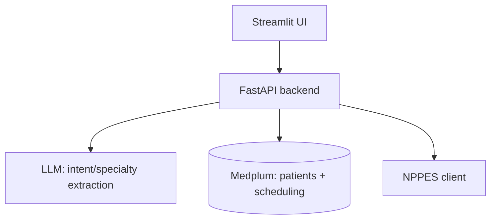

# Doctor Appointment Agent — Application Design

Built on top of the decisions already recorded in `Doctor_Appointment_Agent_Context.md`
(scope, data sources, workflow) and `Real_Appointment_Data_Research.md` (confirms:
no real universal appointment-availability source exists, so scheduling stays
synthetic). Scheduling is modeled natively in Medplum (FHIR `Schedule`/`Slot`/
`Appointment` + its Scheduling API) rather than a separate custom database —
see §5.

## 1. Goals & Non-Goals

**Goal:** demonstrate an AI agent that takes a patient's brief natural-language
appointment request, uses their real FHIR history (Medplum) plus NPPES doctor
discovery, and books them into a synthetic-but-realistic appointment slot.

**Non-goals** (unchanged from context doc): diagnosis, adaptive questionnaires,
clinical decision support, medication recommendations, cancellations,
waitlists, reminders, recurring appointments.

## 2. Tech Stack

| Layer | Choice | Why |
|---|---|---|
| Backend | Python + FastAPI | Good FHIR/Medplum client support, easy LLM orchestration, async-friendly for I/O-bound calls to Medplum/NPPES |
| Frontend | Streamlit | Minimal by design — pure Python, no build step, no separate JS app. Fits a demo-driven POC: patient dropdown, chat-style request box, doctor cards, slot picker, confirmation, all as a handful of Streamlit widgets |
| Data store | Medplum (FHIR) only | Already decided as source of truth for Patient/Condition/MedicationRequest/AllergyIntolerance/Encounter/Practitioner/Organization. Now also holds scheduling data (`Schedule`/`Slot`/`Appointment`) via Medplum's native Scheduling API — no separate database needed (see §5) |
| Doctor discovery | NPPES API | Already decided — directory-only, no availability. Discovered doctors get mirrored into Medplum as `Practitioner` resources so they're schedulable |
| AI | LLM call (provider-agnostic in this doc) for specialty/intent extraction from the NL request | Keeps the interesting "AI" surface area small and testable: one structured-output call, not an open-ended agent loop |

Project is greenfield — no existing code yet.

## 3. High-Level Architecture

The backend is a single FastAPI service (not microservices — no reason to
split processes for a POC) organized into internal modules with clear
boundaries:

- `patients/` — Medplum client wrapper: fetch patient, conditions,
  medications, allergies, encounters; derive "previous physicians" from
  Encounter → Practitioner/Organization references.
- `intent/` — one LLM call: NL request → `{specialty, reason, urgency}`
  structured output. No conversation memory beyond the single request; no
  clinical reasoning.
- `directory/` — NPPES client: search by specialty + location, normalize
  results to an internal `Doctor` shape (NPI, name, specialty, address,
  contact).
- `scheduling/` — owns all interaction with Medplum's `Schedule`/`Slot`/
  `Appointment` resources and Scheduling API (`$find`, `$hold`, `$confirm`);
  lazily creates the `Practitioner` + `Schedule` for a doctor the first time
  they're requested (see §5). This is the only module that talks to Medplum's
  scheduling endpoints.
- `booking/` — thin wrapper around Medplum's `$hold` → `$confirm` operations;
  returns a confirmation or a conflict if the slot was taken concurrently.
- `api/` — FastAPI routers exposing the endpoints in §4, composing the
  modules above. No business logic lives here beyond request/response
  shaping.

Each module is usable and testable independently: `scheduling/` has no
knowledge of `patients/` or `intent/`; `intent/` has no knowledge of Medplum.

## 4. API Surface & Request Flow

Maps directly to the workflow already defined in the context doc:

| Step | Endpoint | Notes |
|---|---|---|
| 1–2. Select patient, load history | `GET /patients`, `GET /patients/{id}/history` | History = conditions, meds, allergies, past encounters (with practitioner/org) pulled from Medplum |
| 3–4. NL request → specialty | `POST /requests` `{patient_id, text}` → `{specialty, reason}` | Single LLM call, structured output |
| 5–6. Check previous encounters | (done as part of `GET /patients/{id}/history`) | Match specialty against practitioners seen before |
| 7. Offer previous physician / search new | `GET /doctors?specialty=&near=` | If a matching previous physician exists, returned first/flagged; otherwise falls through to NPPES search |
| 8. NPPES search | (same endpoint, backed by `directory/` module) | |
| 9–10. Get/create schedule, show slots | `GET /doctors/{npi}/slots?from=&to=` | Lazily creates the doctor's `Practitioner`/`Schedule` in Medplum if they don't exist yet, then calls `$find` (§5) |
| 11. Book slot | `POST /appointments` `{patient_id, npi, slot}` | Calls Medplum `$hold` then `$confirm`; `409` if the slot is no longer available |
| 12. Confirmation | Response of the above | |

## 5. Synthetic Scheduling Design (Medplum-native)

No separate database or slot tables. Everything is modeled as Medplum FHIR
resources, using Medplum's Scheduling API for conflict-free booking.

**Lazy creation**, the first time a doctor's slots are requested:
- If no Medplum `Practitioner` exists for that NPI, create one (mirroring the
  NPPES record: name, specialty, contact).
- Create a `Schedule` for that `Practitioner` with a recurring weekly
  availability template (working hours, lunch break, days off) via the
  `SchedulingParameters` extension. **The NPI is used as a deterministic seed**
  for which template variant a doctor gets (e.g. which days off, which hours),
  so the same doctor always gets the same-looking schedule if regenerated.
- Never recreate the `Practitioner`/`Schedule` for that NPI again — if they
  already exist, just use them.
- Doctors' schedules start **fully open**. There is no pre-seeded fake booking
  history — that was considered and deliberately dropped: it added
  NPI-seeded "which slots to fake-book" logic that doesn't help prove the
  system works. The only appointments that will ever exist are ones created
  during actual use/demo of the app.

**Finding available slots**: `Appointment/$find` computes open times live
from the `Schedule`'s recurring template — nothing is pre-generated or
persisted until an appointment is actually booked.

**Booking a slot**: `Appointment/$hold` (atomically creates a tentative
`Appointment` + busy `Slot` in one FHIR transaction, validating the time is
genuinely still open) followed by `Appointment/$confirm` to finalize. If
`$hold` fails because the slot was taken between listing and booking, the API
surfaces this as a `409` — no custom transaction/locking code needed, Medplum
guarantees this atomically.

## 6. Matching Logic (previous physician vs. new search)

Kept deliberately simple for the POC — not a scored/ranked recommendation
engine, since that wasn't scoped in this pass:

1. From the patient's Medplum Encounter history, find practitioners whose
   specialty matches the LLM-extracted specialty.
2. If ≥1 match: present as "previous physician" option(s), alongside a "search
   for someone new" option.
3. If none: go straight to NPPES search, filtered by specialty and the
   patient's location.

This is intentionally the simplest thing that satisfies the workflow in the
context doc. If richer "best fit" ranking (distance, soonest availability,
insurance, language) is wanted later, it slots in as an additional filter/sort
step on the `GET /doctors` results — noted as an open item in §9, not
designed here since it wasn't decided in this pass.

## 7. Error Handling

- Medplum unreachable / patient not found → surfaced as a clear error to the
  UI, no silent fallback (this is patient data, not something to guess at).
- NPPES returns zero results for a specialty/location → UI shows "no doctors
  found," lets the user broaden the search; not treated as a system error.
- Slot claimed by someone else between listing and booking → Medplum's
  `$hold`/`$confirm` atomically detects this; API returns `409 Conflict`, UI
  re-fetches fresh slots via `$find`.
- LLM fails to extract a specialty confidently → ask the user to clarify
  rather than guessing a specialty (avoids booking into the wrong kind of
  doctor).

## 8. Testing Strategy

Trimmed to match POC scope — this needs to demonstrate the concept works, not
carry a product-grade regression suite:

- **Manual walkthrough checklist**: run the full workflow (steps 1–12)
  end-to-end at least once per change — select patient, submit a request,
  see previous-physician offer or NPPES search, view slots, book, confirm.
- **Smoke test — LLM sanity check**: a small fixed set of example requests →
  expected specialty, run against the real LLM call (not mocked — this is the
  one place correctness is genuinely about the model's output).
- **Smoke test — booking conflict**: book the same slot twice in a row and
  confirm the second attempt is rejected with `409`, proving Medplum's
  `$hold`/`$confirm` atomicity is wired correctly.

No separate unit/integration/e2e tiers, no mocked Medplum/NPPES test harness —
not worth the setup cost for a POC.

## 9. Deployment

Docker Compose with two services: `api` (FastAPI) and `ui` (Streamlit).
Medplum itself runs as an external dependency (managed cloud project or a
separately-run self-hosted instance) — same as NPPES, it's not part of this
app's compose file. No local database to stand up.

## 10. Open Items / Future Work

- **Patient-doctor "fit" ranking** beyond simple specialty match (distance,
  soonest slot, language, insurance) — deferred, not designed here.
- **SMART Scheduling Links** as a future real-data feed if/when general
  (non-vaccine) doctor-appointment publishers mature — explicitly not being
  pursued now.
