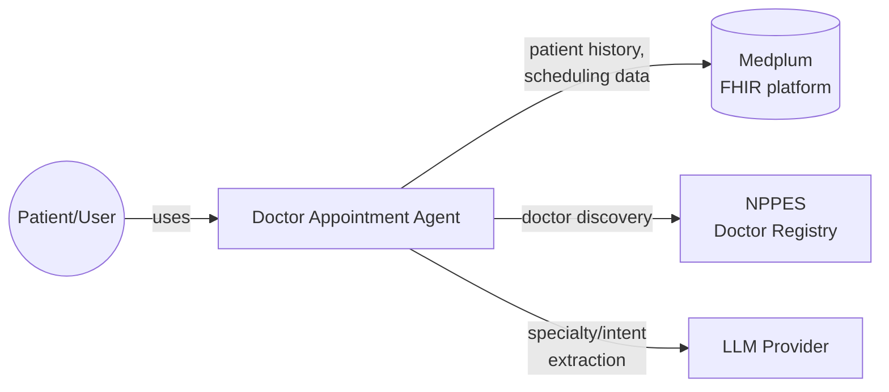
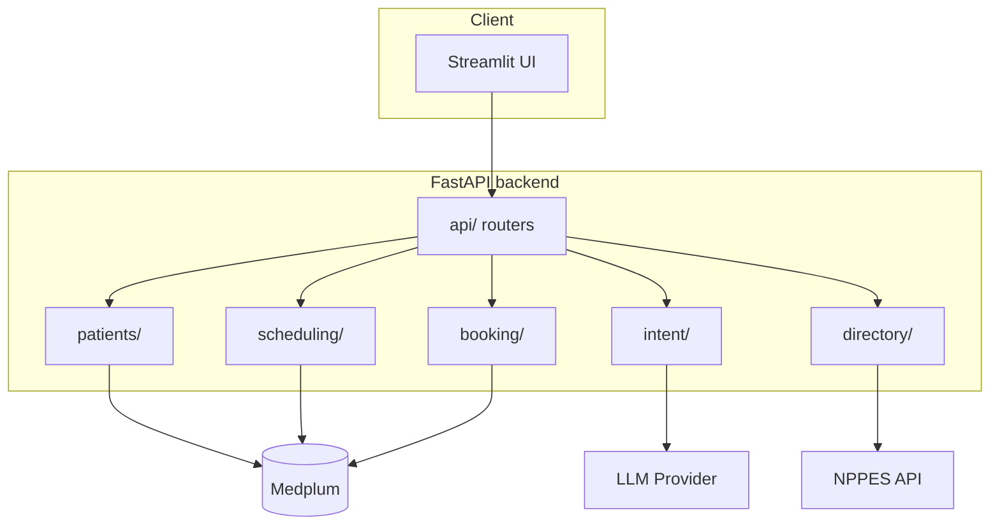
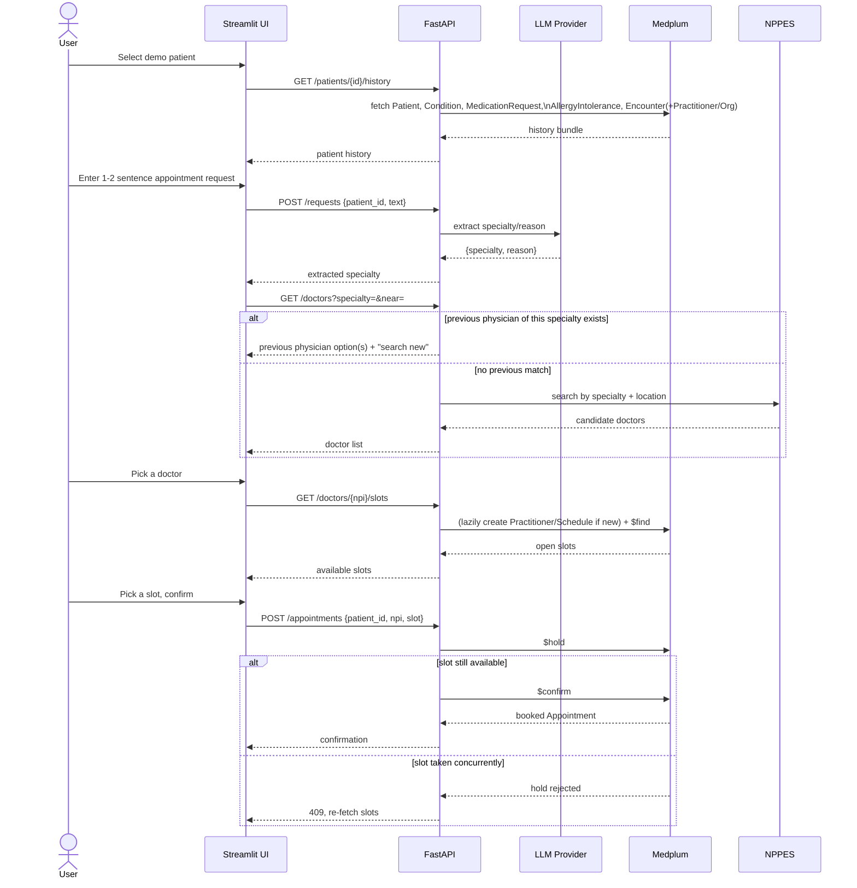
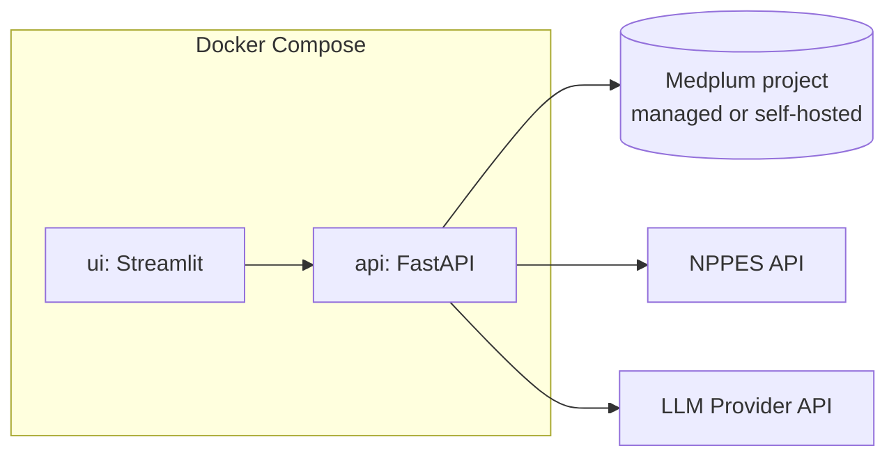

# Doctor Appointment Agent — High-Level Design (HLD)

This sits above `Doctor_Appointment_Agent_Design.md` (which covers module
responsibilities, the API surface, scheduling specifics, error handling, and
testing) — this document covers the system-level view: context, architecture,
primary flow, external interfaces, and what's explicitly out of scope for a
POC. Full requirements/scope live in `Doctor_Appointment_Agent_Context.md`.

## 1. Purpose & Scope

Demonstrate an AI agent that turns a patient's brief natural-language
appointment request into a booked appointment, by combining real patient
history (Medplum), real doctor discovery (NPPES), and synthetic-but-realistic
scheduling (Medplum-native, see Design doc §5). Non-goals unchanged from the
context doc: no diagnosis, no clinical decision support, no cancellations/
waitlists/reminders/recurrence.

## 2. System Context

The application itself owns no clinical or scheduling datastore — Medplum is
the system of record for both (see Design doc §2, §5). NPPES and the LLM
provider are read-only external dependencies.

## 3. High-Level Architecture

Single FastAPI service, no microservices — see Design doc §3 for why, and for
each module's exact responsibility.

## 4. Primary Flow (Sequence)

Covers the full 12-step workflow from the context doc, end to end:

## 5. External Interfaces & Dependencies

| System | Direction | What we use it for | Auth |
|---|---|---|---|
| Medplum | Read/write | Patient history (Patient, Condition, MedicationRequest, AllergyIntolerance, Encounter, Practitioner, Organization); scheduling (Schedule, Slot, Appointment via `$find`/`$hold`/`$confirm`) | Medplum project credentials (client credentials / API key, per Medplum's auth model) |
| NPPES | Read-only | Doctor discovery by specialty/location when no previous physician fits | Public API, no auth required |
| LLM Provider | Read-only (stateless call) | One structured-output call per request: NL text → `{specialty, reason, urgency}` | API key |

No other external systems. Confirmed in `Real_Appointment_Data_Research.md`
that no real appointment-availability feed is being integrated.

## 6. Data Entities (at a glance)

Full field-level shape lives in the Design doc / eventual LLD; this is just
the entity inventory and where each lives:

- **In Medplum (clinical):** `Patient`, `Condition`, `MedicationRequest`,
  `AllergyIntolerance`, `Encounter`
- **In Medplum (scheduling, Medplum-native per Design §5):** `Practitioner`
  (mirrored from NPPES), `Organization`, `Schedule`, `Slot`, `Appointment`
- **Not persisted anywhere:** NPPES search results for doctors not yet booked
  against (only mirrored into Medplum lazily, on first scheduling request)

## 7. Deployment View

Two containers only. Medplum, NPPES, and the LLM provider are external
services, not part of this app's compose file.

## 8. Assumptions & Constraints

- Single local user at a time; the app is a demo, not a multi-tenant service.
- English-only natural-language requests.
- US doctors only (NPPES is a US national registry).
- No authentication/session layer beyond what's needed to demo the workflow —
  access control for real patient data is Medplum's responsibility, not
  something this app builds on top.
- No SLAs, load targets, or scaling design — explicitly out of scope for a
  POC (see §9).

## 9. Non-Functional Considerations (explicitly out of scope for this POC)

- **Scalability/multi-tenancy** — not designed; single-user demo only.
- **Performance targets** — none set; correctness of the flow matters more
  than latency for a POC.
- **Security/compliance hardening** — relies entirely on Medplum's own
  compliance posture (HITRUST-certified per `Real_Appointment_Data_Research.md`
  discussion); this app adds no additional access-control layer.
- **Observability** (logging/metrics/tracing) — not designed; manual
  walkthrough is the verification method per Design doc §8.

## 10. Out of Scope

Unchanged from the context doc: diagnosis, adaptive questionnaires, clinical
decision support, medication recommendations, cancellations, waitlists,
reminders, recurring appointments.

## 11. Related Documents

- `Doctor_Appointment_Agent_Context.md` — requirements, scope, original data-source research
- `Doctor_Appointment_Agent_Design.md` — module responsibilities, API surface, scheduling design, error handling, testing
- `Real_Appointment_Data_Research.md` — research behind the decision to use synthetic scheduling
