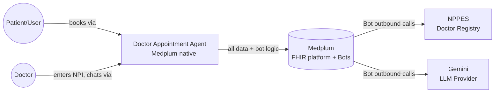
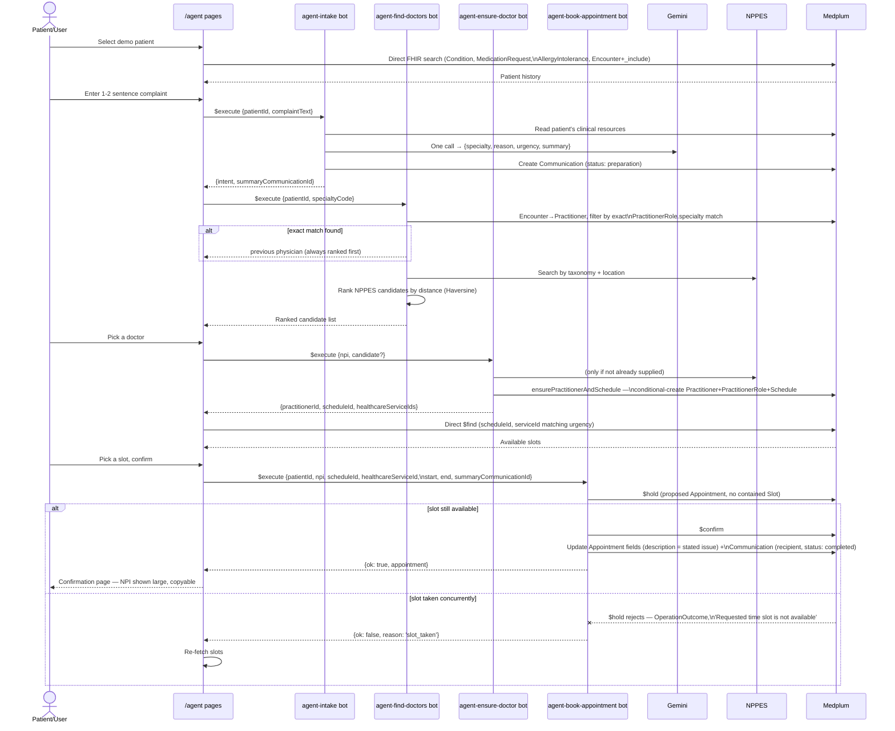
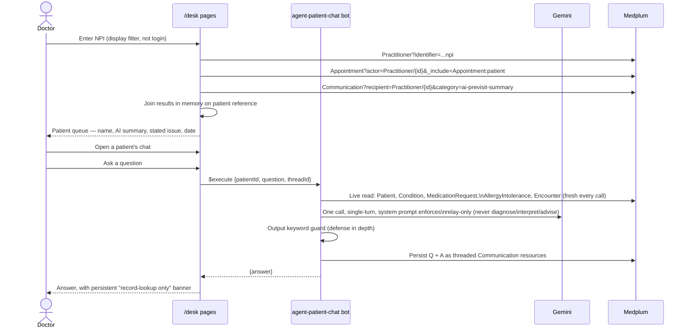
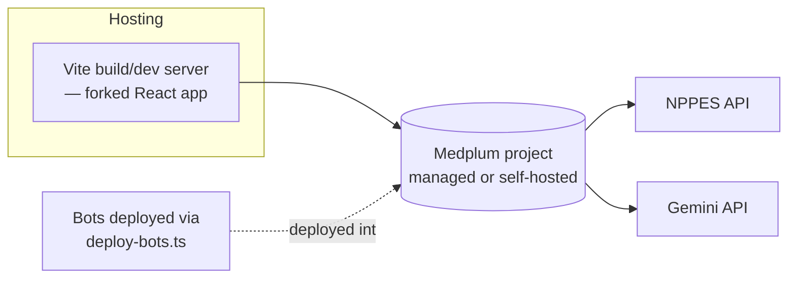

# Doctor Appointment Agent — High-Level Design (HLD)

Sits above `Doctor_Appointment_Agent_Design.md` (module/bot responsibilities,
fork strategy, scheduling mechanics, error handling, testing) — this
document covers the system-level view: context, architecture, both
end-to-end flows as sequence diagrams, external interfaces, and what's
explicitly out of scope. Full requirements/scope live in
`Doctor_Appointment_Agent_Context.md`. Supersedes the previous
Python/FastAPI-era HLD.

## 1. Purpose & Scope

Demonstrate an AI agent that turns a patient's brief natural-language
appointment request into a booked appointment (real history, real doctor
discovery, synthetic-but-realistic scheduling) — and, on the other side,
gives the booked doctor an AI-generated pre-visit summary plus a
record-grounded chat agent to ask follow-up questions. Non-goals unchanged
from the context doc: no diagnosis, no clinical decision support, no
medical advice/judgment from either AI surface.

## 2. System Context



Unlike the original design, the application has no backend of its own at
all — the React frontend and Medplum Bots together *are* the application;
Medplum is not just a datastore called from outside, it's the runtime.
NPPES and Gemini are the only external dependencies, both reached from
inside Bots (confirmed bots can make outbound calls — see Design doc §3).

## 3. High-Level Architecture

```mermaid
flowchart TB
    subgraph Client [Forked medplum-scheduling-demo, React/Vite]
        Existing[Existing pages/components\n— kept as-is]
        AgentPages[/agent/* pages]
        DeskPages[/desk/* pages]
    end
    subgraph Bots [Medplum Bots — src/bots/agent/, src/bots/core/]
        Intake[agent-intake]
        Find[agent-find-doctors]
        Ensure[agent-ensure-doctor]
        Book[agent-book-appointment]
        Chat[agent-patient-chat]
        Expire[agent-expire-holds\ncron]
        Cancel[cancel-appointment\nmodified]
        Reschedule[reschedule-appointment\nnew]
    end
    Lib[(ensurePractitionerAndSchedule\nshared lib, not a bot)]
    Medplum[(Medplum FHIR store)]
    NPPES[NPPES API]
    Gemini[Gemini API]

    AgentPages --> Intake
    AgentPages --> Find
    AgentPages --> Ensure
    AgentPages --> Book
    AgentPages -->|direct FHIR search,\nno bot| Medplum
    DeskPages -->|direct FHIR search,\nno bot| Medplum
    DeskPages --> Chat
    Existing --> Cancel
    Existing --> Reschedule

    Intake --> Gemini
    Intake --> Medplum
    Find --> NPPES
    Find --> Medplum
    Ensure --> NPPES
    Ensure --> Lib
    Book --> Medplum
    Chat --> Gemini
    Chat --> Medplum
    Expire --> Medplum
    Cancel --> Medplum
    Reschedule --> Medplum
    Lib --> Medplum
```

A bot exists only where the browser can't do the work itself (a secret it
can't hold, an endpoint it can't reach — NPPES has no CORS headers,
confirmed by direct request — or a write that must be one atomic
operation). Patient history, previous-physician display, and the doctor's
patient queue are all plain authenticated FHIR searches the frontend makes
directly against Medplum — no bot round-trip for any of them.

## 4. Primary Flow 1 — Patient booking (sequence)



## 5. Primary Flow 2 — Doctor desk & patient-agent chat (sequence)



## 6. External Interfaces & Dependencies

| System | Direction | What we use it for | Auth |
|---|---|---|---|
| Medplum | Read/write | The entire application's data and runtime: Patient/Condition/MedicationRequest/AllergyIntolerance/Encounter (read), Practitioner/PractitionerRole/Schedule/Slot/Appointment/Communication/Device/HealthcareService (read/write), plus hosting the Bots themselves | Confirmed OAuth2 client-credentials (`startClientLogin`) for the seeding tool; frontend uses standard Medplum sign-in; bots receive an already-authenticated `MedplumClient` |
| NPPES | Read-only | Doctor discovery by specialty/location when no exact previous-physician match exists | Public API, no auth — confirmed no CORS headers, so only reachable from a bot |
| Gemini | Read-only (stateless calls) | `agent-intake`: one structured call → specialty/reason/urgency/summary. `agent-patient-chat`: one call per message, grounded in that patient's live data | API key (Bot secret) |

No other external systems. Confirmed in `Real_Appointment_Data_Research.md`
that no real appointment-availability feed is being integrated — scheduling
stays synthetic, now via Medplum's own operations rather than a custom
service.

## 7. Data Entities (at a glance)

Full field-level shape lives in `Doctor_Appointment_Agent_Data_Model.md`;
this is just the entity inventory.

- **Read-only, seeded once**: `Patient`, `Condition`, `MedicationRequest`,
  `AllergyIntolerance`, `Encounter`
- **Two doctor pools, both written into Medplum**: previous physicians
  (from the seeded Synthea bundles, specialty-enriched via the tiered
  matcher) and new doctors (from NPPES, mirrored lazily on first
  scheduling request) — both end up as `Practitioner` + `PractitionerRole`
  either way
- **Scheduling** (Medplum-native): `Schedule` (`serviceType` lists both
  HealthcareServices below), `Slot` (top-level resource, only materializes
  once held/busy — never `contained` in an Appointment), `Appointment`,
  `HealthcareService` (two singletons: Office Visit, Urgent Visit —
  selected by the patient's `urgency`)
- **AI-generated artifacts**: `Communication` (pre-visit summary and every
  chat turn — same resource type for both), `Device` (marks
  machine-authored content)
- **Not persisted anywhere**: NPPES search results for doctors not yet
  booked against

## 8. Deployment View



No Docker Compose, no separate containers for "api"/"ui" as in the
original design — the frontend is a static/dev-served React build, and
all backend logic lives inside Medplum itself as deployed Bots. Medplum,
NPPES, and Gemini are external dependencies, not part of this project's
own deployment surface.

## 9. Assumptions & Constraints

- Single local user at a time per role (one patient session, one doctor
  session) — not a multi-tenant service.
- English-only natural-language input, on both the patient complaint and
  the doctor's chat questions.
- US doctors only (NPPES is a US national registry).
- **NPI entry on `/desk` is a display filter, not authentication** — an
  explicit, deliberate scope decision (see Design doc §11), not an
  oversight.
- No SLAs, load targets, or scaling design — out of scope for a POC.

## 10. Non-Functional Considerations (explicitly out of scope for this POC)

- **Scalability/multi-tenancy** — not designed; single-user-per-role demo
  only.
- **Performance targets** — none set; correctness of both flows matters
  more than latency.
- **Security/compliance hardening** — relies on Medplum's own compliance
  posture; the app adds no additional access-control layer beyond what's
  described in §9. A demonstration `AccessPolicy` is noted as optional
  future work in the Design doc, not part of the core flow.
- **Observability** (logging/metrics/tracing) — not designed; manual
  walkthrough is the verification method (Design doc §13).

## 11. Out of Scope

Unchanged from the context doc: diagnosis, adaptive questionnaires,
clinical decision support, medication recommendations, cancellations,
waitlists, reminders, recurring appointments — plus, specific to this
rebuild, any clinical judgment or advice from the doctor-facing chat
agent, and real per-doctor authentication.

## 12. Related Documents

- `Doctor_Appointment_Agent_Context.md` — requirements, scope, original
  and follow-up data-source research
- `Doctor_Appointment_Agent_Design.md` — fork strategy, bot decomposition,
  scheduling mechanics, seeding tool, safety-boundary design, testing
- `Doctor_Appointment_Agent_Data_Model.md` — full FHIR resource/attribute
  model
- `Doctor_Appointment_Agent_Specs.md` — functional requirements and
  acceptance criteria
- `Real_Appointment_Data_Research.md` — why scheduling is synthetic
